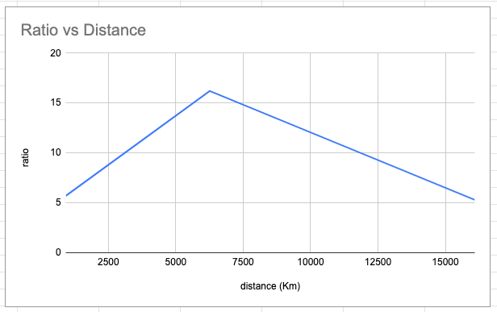

# COMP3331 Lab01

## Exercise 1: nslookup

### 1.1

The IP address of `www.koala.com.au` is:
* `104.18.60.21 `
* `104.18.61.21 `

The site may have a different IP addresses to account for slower computers for load balancing and fault tolerance. 

### 1.2 

The IP address for `127.0.0.1` is for the **localhost**, which is a loopback address.

 It is used to that a developer does not have to send their packets onto the network send it back to their own computer’s IP instead.

 ## Exercise 2: Use ping to test host reachability 

 |URL|Can I ping?|Can I access from browser?|
 |:--------:|:------:|:--------:|
 |www.unsw.edu.au|Yes | Yes
 |www.getfittest.com.au | No | No
|www.mit.edu| Yes | Yes
|www.intel.com.au| Yes | Yes
|www.tpg.com.au| Yes| Yes
|www.hola.hp| No | No
|www.amazon.com| Yes | Yes
|www.tsinghua.edu.cn| Yes | Yes
|www.kremlin.ru| No | Yes
|8.8.8.8 (Google)| Yes | No (It's just a server)

We observe that `www.hola.hp` is not reachable on our browser. This is because the site does not exist as it is an unknown host. 

However, even though we cannot ping `www.kremlin.ru`, but, we can access the website. This could be because the server blocks off attempts to retrieve information in order to avoid being spammed. 

## Exercise 3: Use traceroute to understand network topology

### 3.1 `traceroute www.columbia.edu` 

```
traceroute to www.wwwr53.cc.columbia.edu (128.59.105.24), 64 hops max, 52 byte packets
 1  * * *
 2  ufw1-ae-1-3161.gw.unsw.edu.au (149.171.253.92)  4.406 ms  1.975 ms  1.924 ms
 3  libwdr1-vl-3090.gw.unsw.edu.au (149.171.253.66)  2.224 ms  2.016 ms  2.604 ms
 4  libcr1-te-4-5.gw.unsw.edu.au (149.171.255.89)  2.883 ms  2.481 ms  2.005 ms
 5  unswbr1-te-1-9.gw.unsw.edu.au (149.171.255.101)  12.918 ms  2.120 ms  2.707 ms
 6  138.44.5.0 (138.44.5.0)  2.452 ms  2.754 ms  3.498 ms
 7  et-1-3-0.pe1.sxt.bkvl.nsw.aarnet.net.au (113.197.15.149)  3.537 ms  3.233 ms  4.590 ms
 8  et-0-0-0.pe1.a.hnl.aarnet.net.au (113.197.15.99)  96.650 ms  96.550 ms  100.375 ms
 9  et-2-1-0.bdr1.a.sea.aarnet.net.au (113.197.15.201)  420.864 ms  147.708 ms  147.631 ms
10  abilene-1-lo-jmb-706.sttlwa.pacificwave.net (207.231.240.8)  147.808 ms  147.891 ms  148.463 ms
11  et-4-0-0.4079.rtsw.miss2.net.internet2.edu (162.252.70.0)  159.000 ms  158.898 ms  158.568 ms
12  et-4-0-0.4079.rtsw.minn.net.internet2.edu (162.252.70.58)  182.735 ms  181.609 ms  181.615 ms
13  et-1-1-5.4079.rtsw.eqch.net.internet2.edu (162.252.70.106)  200.883 ms  189.970 ms  189.358 ms
14  ae-0.4079.rtsw3.eqch.net.internet2.edu (162.252.70.163)  189.409 ms  190.745 ms  190.320 ms
15  ae-1.4079.rtsw.clev.net.internet2.edu (162.252.70.130)  198.217 ms  198.240 ms  198.255 ms
16  buf-9208-i2-clev.nysernet.net (199.109.11.33)  202.472 ms  202.623 ms  203.560 ms
17  syr-9208-buf-9208.nysernet.net (199.109.7.193)  206.495 ms  205.839 ms  206.348 ms
18  nyc111-9204-syr-9208.nysernet.net (199.109.7.94)  226.524 ms  308.411 ms  313.450 ms
19  nyc-9208-nyc111-9204.nysernet.net (199.109.7.165)  313.533 ms  307.024 ms  314.411 ms
20  columbia.nyc-9208.nysernet.net (199.109.4.14)  311.262 ms  522.652 ms  312.959 ms
21  cc-core-1-x-nyser32-gw-1.net.columbia.edu (128.59.255.5)  313.315 ms  307.757 ms  216.030 ms
22  cc-conc-1-x-cc-core-1.net.columbia.edu (128.59.255.21)  306.101 ms  307.028 ms  312.929 ms
23  columbiauniversity.net (128.59.105.24)  215.150 ms  282.339 ms  313.062 ms
```
There are 23 routers between my workstation and `www.columbia.edu`. 

There are 5 routers along the path that are a part of the UNSW network. 

By looking at the rount trip times, we can tell that the packet travels across the Pacific ocean between router 7 and 9, entering at 7 and exiting at 9. 
```
 7  et-1-3-0.pe1.sxt.bkvl.nsw.aarnet.net.au (113.197.15.149)  3.537 ms  3.233 ms  4.590 ms
 8  et-0-0-0.pe1.a.hnl.aarnet.net.au (113.197.15.99)  96.650 ms  96.550 ms  100.375 ms
 9  et-2-1-0.bdr1.a.sea.aarnet.net.au (113.197.15.201)  420.864 ms  147.708 ms  147.631 ms
```

### 3.2 Diverging of routers 

`traceroute www.ucla.edu`

```
traceroute to www.ucla.edu (164.67.228.152), 30 hops max, 60 byte packets
 1  cserouter1-server.cse.unsw.EDU.AU (129.94.242.251)  0.231 ms  0.127 ms  0.114 ms
 2  129.94.39.17 (129.94.39.17)  0.897 ms  0.867 ms  0.897 ms
 3  libudnex1-vl-3154.gw.unsw.edu.au (149.171.253.34)  1.648 ms ombudnex1-vl-3154.gw.unsw.edu.au (149.171.253.35)  13.979 ms libudnex1-vl-3154.gw.unsw.edu.au (149.171.253.34)  1.542 ms
 4  ombcr1-po-6.gw.unsw.edu.au (149.171.255.169)  1.133 ms  1.113 ms  1.096 ms
 5  unswbr1-te-1-9.gw.unsw.edu.au (149.171.255.101)  1.156 ms unswbr1-te-2-13.gw.unsw.edu.au (149.171.255.105)  1.134 ms unswbr1-te-1-9.gw.unsw.edu.au (149.171.255.101)  1.090 ms
 6  138.44.5.0 (138.44.5.0)  1.315 ms  1.338 ms  1.303 ms
 7  et-1-3-0.pe1.sxt.bkvl.nsw.aarnet.net.au (113.197.15.149)  2.475 ms  2.156 ms  2.095 ms
 8  et-0-0-0.pe1.a.hnl.aarnet.net.au (113.197.15.99)  95.242 ms  95.194 ms  95.136 ms
 9  et-2-1-0.bdr1.a.sea.aarnet.net.au (113.197.15.201)  146.680 ms  146.607 ms  146.563 ms
10  cenichpr-1-is-jmb-778.snvaca.pacificwave.net (207.231.245.129)  163.036 ms  162.964 ms  163.014 ms
11  hpr-lax-hpr3--svl-hpr3-100ge.cenic.net (137.164.25.73)  160.001 ms  160.611 ms  160.555 ms
12  * * *
13  bd11f1.anderson--cr00f2.csb1.ucla.net (169.232.4.4)  160.491 ms bd11f1.anderson--cr001.anderson.ucla.net (169.232.4.6)  160.564 ms bd11f1.anderson--cr00f2.csb1.ucla.net (169.232.4.4)  161.088 ms
14  cr00f1.anderson--dr00f2.csb1.ucla.net (169.232.4.55)  160.412 ms  160.489 ms cr00f2.csb1--dr00f2.csb1.ucla.net (169.232.4.53)  160.526 ms
15  * * *
16  * * *
17  * * *
18  * * *
19  * * *
20  * * *
21  * * *
22  * * *
23  * * *
24  * * *
25  * * *
26  * * *
27  * * *
28  * * *
29  * * *
30  * * *
``` 

`traceroute www.u-tokyo.ac.jp`

```
traceroute to www.u-tokyo.ac.jp (210.152.243.234), 30 hops max, 60 byte packets
 1  cserouter1-server.cse.unsw.EDU.AU (129.94.242.251)  0.262 ms  0.129 ms  0.119 ms
 2  129.94.39.17 (129.94.39.17)  0.910 ms  0.901 ms  0.818 ms
 3  ombudnex1-vl-3154.gw.unsw.edu.au (149.171.253.35)  9.063 ms libudnex1-vl-3154.gw.unsw.edu.au (149.171.253.34)  1.383 ms ombudnex1-vl-3154.gw.unsw.edu.au (149.171.253.35)  8.947 ms
 4  ombcr1-po-5.gw.unsw.edu.au (149.171.255.197)  1.181 ms libcr1-po-5.gw.unsw.edu.au (149.171.255.165)  1.061 ms ombcr1-po-6.gw.unsw.edu.au (149.171.255.169)  1.079 ms
 5  unswbr1-te-1-9.gw.unsw.edu.au (149.171.255.101)  1.150 ms unswbr1-te-2-13.gw.unsw.edu.au (149.171.255.105)  1.139 ms unswbr1-te-1-9.gw.unsw.edu.au (149.171.255.101)  1.126 ms
 6  138.44.5.0 (138.44.5.0)  1.264 ms  1.313 ms  1.295 ms
 7  et-0-3-0.pe1.bkvl.nsw.aarnet.net.au (113.197.15.147)  3.158 ms  4.052 ms  3.973 ms
 8  ge-4_0_0.bb1.a.pao.aarnet.net.au (202.158.194.177)  157.103 ms  157.027 ms  156.985 ms
 9  paloalto0.iij.net (198.32.176.24)  157.631 ms  157.580 ms  157.557 ms
10  osk004bb01.IIJ.Net (58.138.88.189)  270.541 ms osk004bb00.IIJ.Net (58.138.88.185)  267.448 ms  267.402 ms
11  osk004ip57.IIJ.Net (58.138.106.166)  268.871 ms osk004ip57.IIJ.Net (58.138.106.162)  268.794 ms  268.836 ms
12  210.130.135.130 (210.130.135.130)  267.402 ms  267.342 ms  267.436 ms
13  124.83.228.58 (124.83.228.58)  267.405 ms  269.169 ms  269.100 ms
14  124.83.252.178 (124.83.252.178)  273.804 ms  274.766 ms  274.922 ms
15  158.205.134.26 (158.205.134.26)  276.343 ms  276.499 ms  276.422 ms
16  * * *
17  * * *
18  * * *
19  * * *
20  * * *
21  * * *
22  * * *
23  * * *
24  * * *
25  * * *
26  * * *
27  * * *
28  * * *
29  * * *
30  * * *
```

`traceroute www.lancaster.ac.uk`

```
traceroute to www.lancaster.ac.uk (148.88.65.80), 30 hops max, 60 byte packets
 1  cserouter1-server.cse.unsw.EDU.AU (129.94.242.251)  0.154 ms  0.125 ms  0.107 ms
 2  129.94.39.17 (129.94.39.17)  0.886 ms  0.892 ms  0.865 ms
 3  ombudnex1-vl-3154.gw.unsw.edu.au (149.171.253.35)  1.385 ms libudnex1-vl-3154.gw.unsw.edu.au (149.171.253.34)  1.361 ms ombudnex1-vl-3154.gw.unsw.edu.au (149.171.253.35)  1.511 ms
 4  libcr1-po-5.gw.unsw.edu.au (149.171.255.165)  1.190 ms  1.238 ms libcr1-po-6.gw.unsw.edu.au (149.171.255.201)  1.112 ms
 5  unswbr1-te-1-9.gw.unsw.edu.au (149.171.255.101)  1.162 ms unswbr1-te-2-13.gw.unsw.edu.au (149.171.255.105)  1.145 ms unswbr1-te-1-9.gw.unsw.edu.au (149.171.255.101)  1.116 ms
 6  138.44.5.0 (138.44.5.0)  1.343 ms  1.370 ms  1.304 ms
 7  et-2-0-5.bdr1.sing.sin.aarnet.net.au (113.197.15.233)  92.759 ms  92.700 ms  92.615 ms
 8  138.44.226.7 (138.44.226.7)  256.328 ms  256.276 ms  256.216 ms
 9  janet-gw.mx1.lon.uk.geant.net (62.40.124.198)  256.349 ms  256.278 ms  256.237 ms
10  ae29.londpg-sbr2.ja.net (146.97.33.2)  256.802 ms  256.750 ms  256.711 ms
11  ae31.erdiss-sbr2.ja.net (146.97.33.22)  260.459 ms  260.478 ms  260.443 ms
12  ae29.manckh-sbr2.ja.net (146.97.33.42)  262.433 ms  262.597 ms  262.433 ms
13  ae24.lanclu-rbr1.ja.net (146.97.38.58)  264.712 ms  264.769 ms  264.705 ms
14  lancaster-university.ja.net (194.81.46.2)  332.819 ms  332.517 ms  332.412 ms
15  is-border01.bfw01.rtr.lancs.ac.uk (148.88.253.202)  265.192 ms  265.118 ms  265.073 ms
16  bfw01.iss-servers.is-core01.rtr.lancs.ac.uk (148.88.250.98)  270.845 ms  268.283 ms  268.335 ms
17  * * *
18  www.lancs.ac.uk (148.88.65.80)  265.330 ms !X  265.321 ms !X  265.359 ms !X
```
Looking at the traceroutes of the 3 sites, we observe their divergence at router 7. 

`7  et-0-3-0.pe1.bkvl.nsw.aarnet.net.au (113.197.15.147)  3.158 ms  4.052 ms  3.973 ms`

Upon running `whois 113.197.15.233`, we obtain: 

```
inetnum:        113.197.15.0 - 113.197.15.255
netname:        IIPC
descr:          Customer Connection Network
country:        AU
last-modified:   2011-10-20T08:36:39Z
irt:            IRT-AARNET-AU
address:        AARNet Pty Ltd
address:        26 Dick Perry Avenue
address:        Kensington, Western Australia
address:        Australia
mnt-by:         MAINT-AARNET-AP
source:         APNIC
role:           AARNet Network Operations Centre
```
### 3.3 Reverse Traceroute 

Traceroute from `http://www.speedtest.com.sg/tr.php`

```
raceroute to 129.94.8.140 (129.94.8.140), 30 hops max, 60 byte packets
 1  ge2-8.r01.sin01.ne.com.sg (202.150.221.169)  0.143 ms  0.164 ms  0.174 ms
 2  10.15.62.210 (10.15.62.210)  0.225 ms  0.329 ms  0.343 ms
 3  aarnet.sgix.sg (103.16.102.67)  209.219 ms  209.233 ms  209.245 ms
 4  et-7-3-0.pe1.nsw.brwy.aarnet.net.au (113.197.15.232)  212.716 ms  212.761 ms  212.730 ms
 5  138.44.5.1 (138.44.5.1)  208.358 ms  208.433 ms  208.364 ms
 6  libcr1-te-1-5.gw.unsw.edu.au (149.171.255.102)  208.318 ms  208.330 ms  208.282 ms
 7  libwdr1-te-1-1.gw.unsw.edu.au (149.171.255.90)  209.642 ms  209.585 ms  209.672 ms
 8  cfw1-ae-1-3090.gw.unsw.edu.au (149.171.253.68)  209.980 ms  209.880 ms  209.918 ms
 9  * * *
10  * * *
11  * * *
12  * * *
13  * * *
14  * * *
15  * * *
16  * * *
17  * * *
18  * * *
19  * * *
20  * * *
21  * * *
22  * * *
23  * * *
24  * * *
25  * * *
26  * * *
27  * * *
28  * * *
29  * * *
30  * * *
```

Traceroute from `https://www.telstra.net/cgi-bin/trace`

```

 1  gigabitethernet3-3.exi2.melbourne.telstra.net (203.50.77.53)  0.266 ms  0.204 ms  0.241 ms
 2  bundle-ether3-100.win-core10.melbourne.telstra.net (203.50.80.129)  1.110 ms  1.478 ms  2.113 ms
 3  bundle-ether12.ken-core10.sydney.telstra.net (203.50.11.122)  12.483 ms  12.098 ms  12.857 ms
 4  bundle-ether1.ken-edge901.sydney.telstra.net (203.50.11.95)  11.982 ms  11.850 ms  11.855 ms
 5  aarnet6.lnk.telstra.net (139.130.0.78)  11.607 ms  11.601 ms  11.607 ms
 6  xe-5-2-2.pe1.brwy.nsw.aarnet.net.au (113.197.15.32)  11.859 ms  11.724 ms  11.731 ms
 7  138.44.5.1 (138.44.5.1)  11.986 ms  11.979 ms  11.980 ms
 8  ombcr1-te-1-5.gw.unsw.edu.au (149.171.255.106)  12.107 ms  11.975 ms  11.982 ms
 9  libwdr1-te-1-2.gw.unsw.edu.au (149.171.255.78)  12.227 ms  12.097 ms  11.986 ms
10  cfw1-ae-1-3090.gw.unsw.edu.au (149.171.253.68)  12.604 ms  12.600 ms  12.607 ms
```

I've also chosen to get the traceroute from Iceland and Germany. 

Traceroute from `www.rhnet.is/cgi-bin/rh-traceroute`

```
traceroute to 129.94.242.116 (129.94.242.116), 64 hops max, 40 byte packets
 1  ndn-gw1-ge2-0-0 (130.208.16.13)  0.167 ms  0.152 ms  0.144 ms
 2  is-rey.nordu.net (109.105.102.1)  0.217 ms  0.174 ms  0.187 ms
 3  uk-hex.nordu.net (109.105.97.41)  37.896 ms  37.921 ms  37.954 ms
 4  nl-sar.nordu.net (109.105.97.124)  42.962 ms  42.767 ms  42.829 ms
 5  us-man.nordu.net (109.105.97.139)  133.047 ms
    us-man.nordu.net (109.105.97.64)  127.771 ms  127.796 ms
 6  xe-2-3-0.118.rtr.newy32aoa.net.internet2.edu (109.105.98.10)  130.630 ms  130.504 ms  127.959 ms
 7  ae-3.4079.rtsw.wash.net.internet2.edu (162.252.70.138)  133.233 ms  133.287 ms  133.169 ms
 8  ae-0.4079.rtsw2.ashb.net.internet2.edu (162.252.70.137)  136.455 ms  136.163 ms  136.725 ms
 9  ae-2.4079.rtsw.ashb.net.internet2.edu (162.252.70.74)  136.258 ms  139.271 ms  136.670 ms
10  ae-20.4079.rtsw.clev.net.internet2.edu (162.252.70.129)  143.939 ms  143.933 ms  144.015 ms
11  ae-3.4079.rtsw3.eqch.net.internet2.edu (162.252.70.131)  155.867 ms  155.776 ms  180.743 ms
12  ae-5.4079.rtsw.eqch.net.internet2.edu (162.252.70.162)  153.078 ms  155.527 ms  155.494 ms
13  et-7-0-0.4079.rtsw.minn.net.internet2.edu (162.252.70.107)  158.033 ms  160.653 ms  158.086 ms
14  et-7-0-0.4079.rtsw.miss2.net.internet2.edu (162.252.70.59)  181.223 ms  181.164 ms  183.886 ms
15  et-4-1-0.4079.rtsw.seat.net.internet2.edu (162.252.70.1)  193.942 ms  196.600 ms  198.372 ms
16  aarnet-2-lo-jmb-706.sttlwa.pacificwave.net (207.231.240.4)  196.664 ms  194.048 ms  196.706 ms
17  et-2-0-0.pe1.a.hnl.aarnet.net.au (113.197.15.200)  248.635 ms  246.063 ms  248.633 ms
18  et-2-1-0.pe1.sxt.bkvl.nsw.aarnet.net.au (113.197.15.98)  339.174 ms  339.453 ms  339.169 ms
19  et-3-3-0.pe1.brwy.nsw.aarnet.net.au (113.197.15.148)  318.786 ms  317.441 ms  314.702 ms
20  138.44.5.1 (138.44.5.1)  341.742 ms  317.585 ms  314.798 ms
21  libcr1-te-1-5.gw.unsw.edu.au (149.171.255.102)  314.878 ms  317.627 ms  314.834 ms
22  libudnex1-po-1.gw.unsw.edu.au (149.171.255.166)  315.088 ms  317.995 ms  317.958 ms
23  ufw1-ae-1-3154.gw.unsw.edu.au (149.171.253.36)  318.354 ms  315.484 ms  315.660 ms
24  129.94.39.23 (129.94.39.23)  315.705 ms  315.835 ms  318.409 ms
25  * * *
26  * * *
27  * * *
28  * * *
29  * * *
30  * * *
31  * * *
32  * * *
33  * * *
34  * * *
35  * * *
36  * * *
37  * * *
38  * * *
39  * * *
40  * * *
```

Traceroute from `www.han.de/cgi-bin/nph-trace.cgi`

```
traceroute to 129.94.242.116 (129.94.242.116), 30 hops max, 60 byte packets
 1  * * *
 2  ae3-u100.cr-nunki.sxb1.bb.godaddy.com (87.230.112.2)  0.938 ms  0.925 ms  0.913 ms
 3  be4257.nr14.b015623-2.sxb01.atlas.cogentco.com (149.14.12.45)  0.984 ms  1.006 ms  1.119 ms
 4  be2781.rcr21.sxb01.atlas.cogentco.com (154.25.8.233)  0.926 ms  1.008 ms  0.822 ms
 5  be3548.ccr42.fra03.atlas.cogentco.com (154.54.59.133)  3.937 ms be3546.ccr41.fra03.atlas.cogentco.com (154.54.59.33)  3.774 ms be3548.ccr42.fra03.atlas.cogentco.com (154.54.59.133)  3.964 ms
 6  be3186.agr41.fra03.atlas.cogentco.com (130.117.0.2)  3.809 ms  3.697 ms be3187.agr41.fra03.atlas.cogentco.com (130.117.1.117)  3.675 ms
 7  ntt.fra03.atlas.cogentco.com (130.117.14.130)  4.017 ms  4.084 ms  4.135 ms
 8  ae-1.r25.frnkge08.de.bb.gin.ntt.net (129.250.4.16)  7.562 ms  7.850 ms  7.511 ms
 9  ae-8.r22.asbnva02.us.bb.gin.ntt.net (129.250.4.96)  89.237 ms  93.191 ms  89.881 ms
10  ae-5.r23.lsanca07.us.bb.gin.ntt.net (129.250.3.189)  154.268 ms  152.098 ms  155.731 ms
11  ae-2.r00.lsanca07.us.bb.gin.ntt.net (129.250.3.238)  154.086 ms  154.136 ms ae-2.r01.lsanca07.us.bb.gin.ntt.net (129.250.4.107)  154.171 ms
12  ae-0.a02.lsanca07.us.bb.gin.ntt.net (129.250.2.186)  148.799 ms ae-1.a02.lsanca07.us.bb.gin.ntt.net (129.250.3.234)  151.111 ms  151.087 ms
13  xe-0-0-6-3.a02.lsanca07.us.ce.gin.ntt.net (204.1.253.166)  148.747 ms  148.991 ms  149.332 ms
14  xe-0-2-1.pe1.alxd.nsw.aarnet.net.au (202.158.194.172)  291.489 ms  295.648 ms  295.200 ms
15  et-8-1-0.pe1.brwy.nsw.aarnet.net.au (113.197.15.152)  290.554 ms  292.039 ms  293.907 ms
16  138.44.5.1 (138.44.5.1)  292.208 ms  294.073 ms  288.188 ms
17  libcr1-te-1-5.gw.unsw.edu.au (149.171.255.102)  294.097 ms  294.040 ms  288.176 ms
18  libudnex1-po-1.gw.unsw.edu.au (149.171.255.166)  292.600 ms  291.134 ms  289.977 ms
19  ufw1-ae-1-3154.gw.unsw.edu.au (149.171.253.36)  291.186 ms  291.418 ms  291.355 ms
20  129.94.39.23 (129.94.39.23)  291.411 ms  293.318 ms  291.410 ms
21  * * *
22  * * *
23  * * *
24  * * *
25  * * *
26  * * *
27  * * *
28  * * *
29  * * *
30  * * *
```
If we tried to `traceroute www.han.de` from the CSE servers: 


```
traceroute to www.han.de (5.35.241.151), 30 hops max, 60 byte packets
 1  cserouter1-server.cse.unsw.EDU.AU (129.94.242.251)  0.215 ms  0.123 ms  0.118 ms
 2  129.94.39.17 (129.94.39.17)  0.871 ms  0.877 ms  0.872 ms
 3  libudnex1-vl-3154.gw.unsw.edu.au (149.171.253.34)  1.721 ms  1.663 ms ombudnex1-vl-3154.gw.unsw.edu.au (149.171.253.35)  1.320 ms
 4  libcr1-po-5.gw.unsw.edu.au (149.171.255.165)  1.359 ms  1.311 ms ombcr1-po-6.gw.unsw.edu.au (149.171.255.169)  14.532 ms
 5  unswbr1-te-2-13.gw.unsw.edu.au (149.171.255.105)  29.752 ms  29.702 ms unswbr1-te-1-9.gw.unsw.edu.au (149.171.255.101)  29.641 ms
 6  138.44.5.0 (138.44.5.0)  1.720 ms  1.636 ms  1.498 ms
 7  et-0-3-0.pe1.bkvl.nsw.aarnet.net.au (113.197.15.147)  1.949 ms  1.891 ms  1.834 ms
 8  xe-0-2-5.bdr1.b.sea.aarnet.net.au (202.158.194.121)  143.938 ms  143.871 ms  143.810 ms
 9  xe-4-1-1.mpr1.sea1.us.above.net (64.125.193.129)  143.824 ms  143.878 ms  143.890 ms
10  ae27.cs1.sea1.us.eth.zayo.com (64.125.29.0)  266.119 ms  266.779 ms  266.728 ms
11  * * *
12  ae3.cs1.lga5.us.eth.zayo.com (64.125.29.208)  270.811 ms  284.820 ms  284.748 ms
13  ae5.cs1.lhr11.uk.eth.zayo.com (64.125.29.127)  266.341 ms  272.704 ms  266.533 ms
14  ae27.mpr2.lhr2.uk.zip.zayo.com (64.125.30.237)  266.461 ms  266.393 ms  266.305 ms
15  ae11.mpr1.lhr15.uk.zip.zayo.com (64.125.30.53)  266.120 ms  267.368 ms  266.958 ms
16  ae1.cr-sargas.lon1.bb.godaddy.com (195.66.225.173)  270.288 ms  270.238 ms  270.175 ms
17  ae0.cr-merak.lon5.bb.godaddy.com (87.230.113.1)  269.330 ms  269.160 ms  269.111 ms
18  ae0.cr-nunki.sxb1.bb.godaddy.com (87.230.113.3)  291.746 ms  291.698 ms  291.659 ms
19  ae0-v100.sr-sol.sxb1.mass.systems (87.230.112.3)  295.442 ms  295.424 ms  295.392 ms
20  * * *
21  haldir.han.de (5.35.241.151)  293.429 ms  293.439 ms  293.413 ms
```

We can observe similar paths at the beginning and end of both traceroutes. 

```
 1  cserouter1-server.cse.unsw.EDU.AU (129.94.242.251)  0.215 ms  0.123 ms  0.118 ms
 2  129.94.39.17 (129.94.39.17)  0.871 ms  0.877 ms  0.872 ms
 3  libudnex1-vl-3154.gw.unsw.edu.au (149.171.253.34)  1.721 ms  1.663 ms ombudnex1-vl-3154.gw.unsw.edu.au (149.171.253.35)  1.320 ms
 4  libcr1-po-5.gw.unsw.edu.au (149.171.255.165)  1.359 ms  1.311 ms ombcr1-po-6.gw.unsw.edu.au (149.171.255.169)  14.532 ms
 5  unswbr1-te-2-13.gw.unsw.edu.au (149.171.255.105)  29.752 ms  29.702 ms unswbr1-te-1-9.gw.unsw.edu.au (149.171.255.101)  29.641 ms
 6  138.44.5.0 (138.44.5.0)  1.720 ms  1.636 ms  1.498 ms
 7  et-0-3-0.pe1.bkvl.nsw.aarnet.net.au (113.197.15.147)  1.949 ms  1.891 ms  1.834 ms
 8  xe-0-2-5.bdr1.b.sea.aarnet.net.au (202.158.194.121)  143.938 ms  143.871 ms  143.810 ms
 9  xe-4-1-1.mpr1.sea1.us.above.net (64.125.193.129)  143.824 ms  143.878 ms  143.890 ms
10  ae27.cs1.sea1.us.eth.zayo.com (64.125.29.0)  266.119 ms  266.779 ms  266.728 ms
```

and 
```
14  xe-0-2-1.pe1.alxd.nsw.aarnet.net.au (202.158.194.172)  291.489 ms  295.648 ms  295.200 ms
15  et-8-1-0.pe1.brwy.nsw.aarnet.net.au (113.197.15.152)  290.554 ms  292.039 ms  293.907 ms
16  138.44.5.1 (138.44.5.1)  292.208 ms  294.073 ms  288.188 ms
17  libcr1-te-1-5.gw.unsw.edu.au (149.171.255.102)  294.097 ms  294.040 ms  288.176 ms
18  libudnex1-po-1.gw.unsw.edu.au (149.171.255.166)  292.600 ms  291.134 ms  289.977 ms
19  ufw1-ae-1-3154.gw.unsw.edu.au (149.171.253.36)  291.186 ms  291.418 ms  291.355 ms
20  129.94.39.23 (129.94.39.23)  291.411 ms  293.318 ms  291.410 ms
```

However, the routers in between are completely different. 

This may be because within CSE servers, there may be a specified route before it is released into the 'internet', where hops depend on numerous other factors.


## Exercise 4: Use ping to gain insights into network performance 

### 4.1 Time to propagate from UNSW 


|Site|IP Address|Distance (KM)|Time taken @ 3 x 10^8m/s (ms)|Minimum Delay (50byte packets)| Ratio (Time taken: Min Delay)| 
|:---:|:---:|:---:|:---:|:---:|:---:|
|www.uq.edu.au | 130.102.131.123| 920 | 3 | 17.2 | 5.7
|www.dlsu.edu.ph | 103.231.241.180| 6,260 | 21 | 341.7 | 16.2
|www.tu-berlin.de|130.149.7.201|16, 090|  53 | 283.7 | 5.3

### 4.2 Delay Analysis 

Our ratios are not constant over time. This may be because for `www.dlsu.edu.ph`, there does not exist an 'express' route, hence taking longer even though it is physically closer than `www.tu-berlin.de`. 

 


### 4.3 Explore `www.epfl.ch`

The IP address for `www.epfl.ch` is `104.20.229.42`. It is hosted by an organisation called **Cloudflare Inc.** located in 101 Townsend St, San Francisco, US. However, it _is_ a website for a company in Switzerland.

### 4.4 Delay vs Packet Size

|Packet size | www.uq.edu.au | www.dlsu.edu.ph | www.tu-berlin.de | 
|:---:|:---:|:---:|:---:|
|50|17.2|341.5|283.6
|250|17.4|341.7|283.8|
|500|17.5|342.0|283.9|
|750|17.7|342.3|283.9|
|1000|17.74|284.0|284.0|
|1250|17.9|284.1|284.1|
|1500|18.6|284.1| 284.2|

The delay to destinations have remained fairly constant, despite the change in packet size. The small differences may be due to transmission and processing delay, causing minor differences when packet size increases. Other factors may include congestion in the network. However, as the results were sent at around the same time, the delay has been fairly consistent.


_ekwnerw_ 

