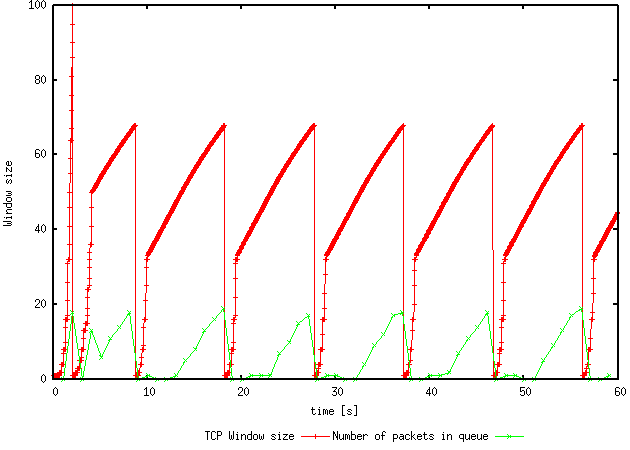
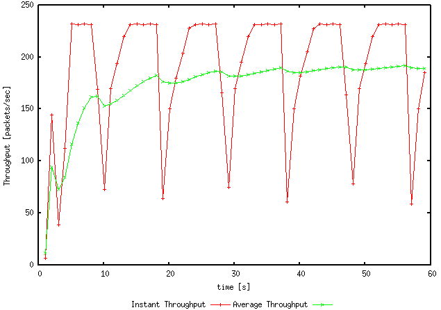
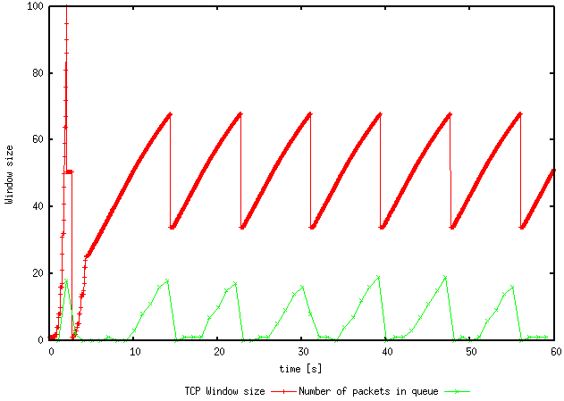
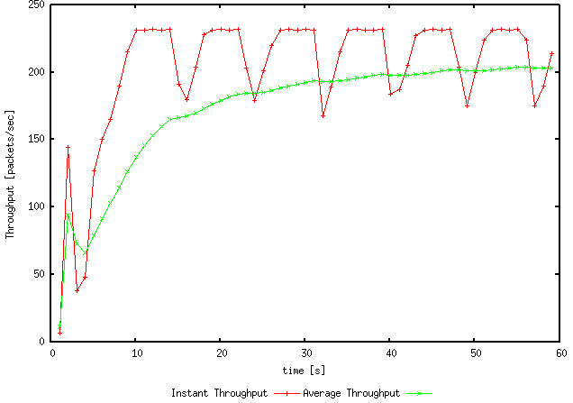
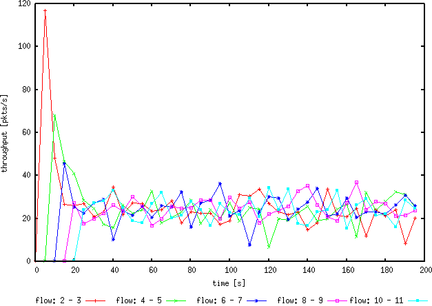
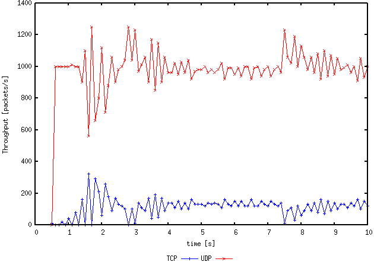

# COMP3331 Lab05 

## Exercise 0: Revision of TCP 
### 0.1 Loss events @ 1&2
@1 Duplicate ACK 
@2 Timeout  
### 0.2-4 Phases @ 3&4 
@3 Slow Start (exponential)  
@4 AIMD (Linear) 
### 0.5 After 2 
After 2 it starts with Slow Start again 

## Exercise 1: Understanding TCP Congestion control using ns-2 

### 1.1 Maximum Size of Congestion Window 

Maximum Size: 100  

When the congestion reaches 100, it drops back down to 1 and thresh-hold halves.  

This happens because there is a loss event (timeout) so it drops to one and starts again with half the threshhold (value at which the TCP phase changes from Slow Start to AIMD) 

### 1.2 Average Throughput 

From the graph, the average throughout is 185 packets/sec. 

### 1.3 Varying Congestion Window Size 

By trying lower window sizes we experience less timeout and package loss.(Anthing above 100 will look the same as the first loss is experienced @100 and so it caps at 100) 

At window size 50, there are no timeouts or package losses and TCP stops oscillating.

### 1.4 Set to TCP Reno 

a) Maximum Size: (still) 100. TCP Reno only cares if there's timeout or 3DupACKs.  
 
b) Average throughput: 195 packets/sec

## Exercise 2: Flow Fairness with TCP 
### 2.1 Equal Share 

Each flow gets an equal share of the capacity of the common link. We can tell this as all the throughput is clustered around the same area. 

### 2.2 New flows 

The throughput of the pre-existing TCP flow when a new flow joins decreases dramatically as an extra person starts using parts of the bandwidth. This is fair as everyone ends up with the same bandwidth so everyone has a connection. 

## Exercise 3 TCP Vs UDP 
### 3.1 Behaviour 
**TCP:** TCP will be careful with the usage of the capacity/bandwidth  
**UDP:** UDP will just use as much as possible (spam!) 

Looking at the simulation, we can tell the red colour is UDP as it is pumping out as many packets as possible while the blue one is TCP, only sparingly sending packets in comparison. 

### 3.2 Comparisons 

UDP has higher throughput than TCP because it doesn't have to worry about congestion control. UDP fires as many packets as it can in any bandwidth. TCP uses it's two phases - slow start and AIMD to stablise. 

### 3.3 Adv vs DisAdv

**Advantages** 
* Fast transfer rates (UDP uses most of the bandwidth)

**Disadvantages**
* Might experience packet loss or sending to the wrong place - then increased time taken 

If everyone started using UDP, then throughput would be low as everyone is sharing the bandwidth (using as much as possible) and it would not be a reliable way of transferring, resulting in multiple requests and possible congestions.

