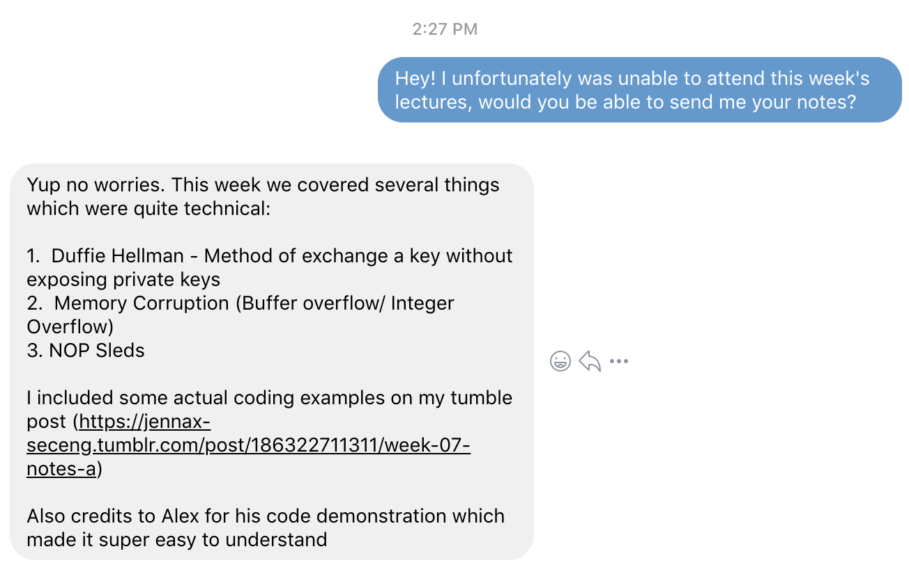
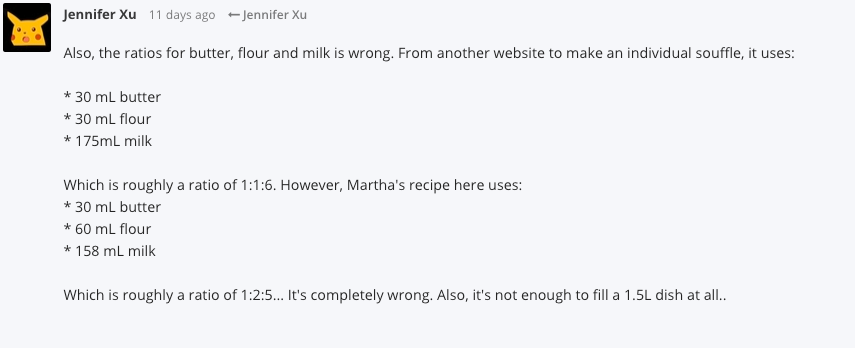
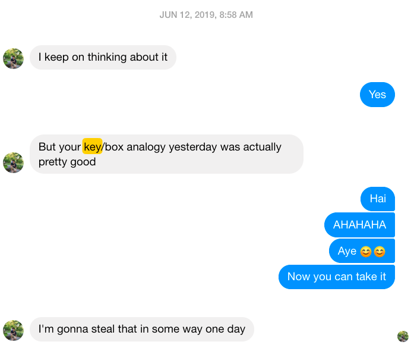

# Community and Professionalism 

The environment surrounding the security engineering field is a very involved and collaboratory one which I have contributed to throughout this course. I have formed connections with my fellow peers which allowed me to work effectively in a team. 

## Contribution 
* Contributed and effectively explained week 7 technical content to a fellow peeras demonstrated. 

* Contributing ideas on activities on the forum 
 

## Feedback and Communication
For my something awesome, I had also researched about Cookies and explained it to one of my peers using a key/box analogy which I was commended on.
 

## Security Everywhere Posts
Despite only having 3 security everywhere posts, this course has  ~~traumatised~~ become an issue of awareness in my everyday life. 

* [Security Everywhere: How to go missing?](https://jennax-seceng.tumblr.com/post/185669505381/security-everywhere-literally)
* [Security Everywhere: Disaster in HongKong](https://jennax-seceng.tumblr.com/post/185772795136/yes-its-hmk-spamming-time)
* [Security Everywhere: Hidden Design](https://jennax-seceng.tumblr.com/post/186132832331/security-everywhere-hidden-design)