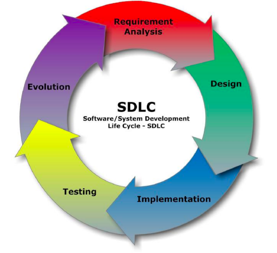

# Software Engineering 

Software engineering bridges the gap between the *business problem* and *business goal*. 

The aim of software engineering is to design solutions which accurately target the customer's needs, aka deliver value to the customer. 

It's all about that systematic appproach!  

## Why we need SE? 

* To build what the customer actually wants, and not what we think they want - through detailed userstories 
* To deliver software ontime and onbudget 
* Minimise errors/defects 
* Ensure functionality, reliability, security and maintainability of the code 

## 1. Software Development Life Cycles

#### M E T H O D O L O G Y 

The **methodology** is a *framework* to structure plan and control the development of the software system. 

 

#### Analysis/Specification 

Discover the brand-new world of PROBLEMS that we need to solve (o-wait).   

Questions we should ask ourselves..

1. What is the problem domain? 
2. What is the 'system-to-be' 
3. What are the functional/non-functional requirements 

> Functional Requirements: Input outputs of the system   

> Non-functional Requirements: Security, quanlity, maintability, extensibility etc   

> (More design choice tbh, since it's not the client telling you they NEED these things, it's how you choose to implement a solution to their problem)

#### Design 

It is time to showcase our creativity - HAH! Good one!11!1 

Things to do now: 
1.  Plan out the internal structure to deliver the external behaviour 
2. Produce software blueprints (And ur job is done here) 

## Software Development Methodologies 

AKA How we can carry out our life-cycles.  

#### Waterfall Model 

* Is a linear sequential project life-cycle characterised by detailed planning:    
  1. Problem is identified, documented and designed 
  2. Implementation tasks identified, scoped and scheduled 
  3. Development cycle followed by testing cycle
* Once a task is completed and documented, you cannot go back to the same task 
* Project visibility 
* Suitable for **stable** products (those with well known requirements)  
* Rigid, not flexible and not possible for fine tuning 

#### Incremental and Iterative Project Life-Cycle 
These approaches break big problems down   
After each iteration, you seek cusomter feedback and change the course based on improved understanding   

> **Interation** refers to a step in the life-cycle

It seeks to get a working instance as soon as possible and progressively understand or viaulise the product  

Some examples include: 
* Unified Software development process  
* Rational Unified Process (Lect06)
* Agile methodologies (XP, SCRUM) 

# Summary

  
 
